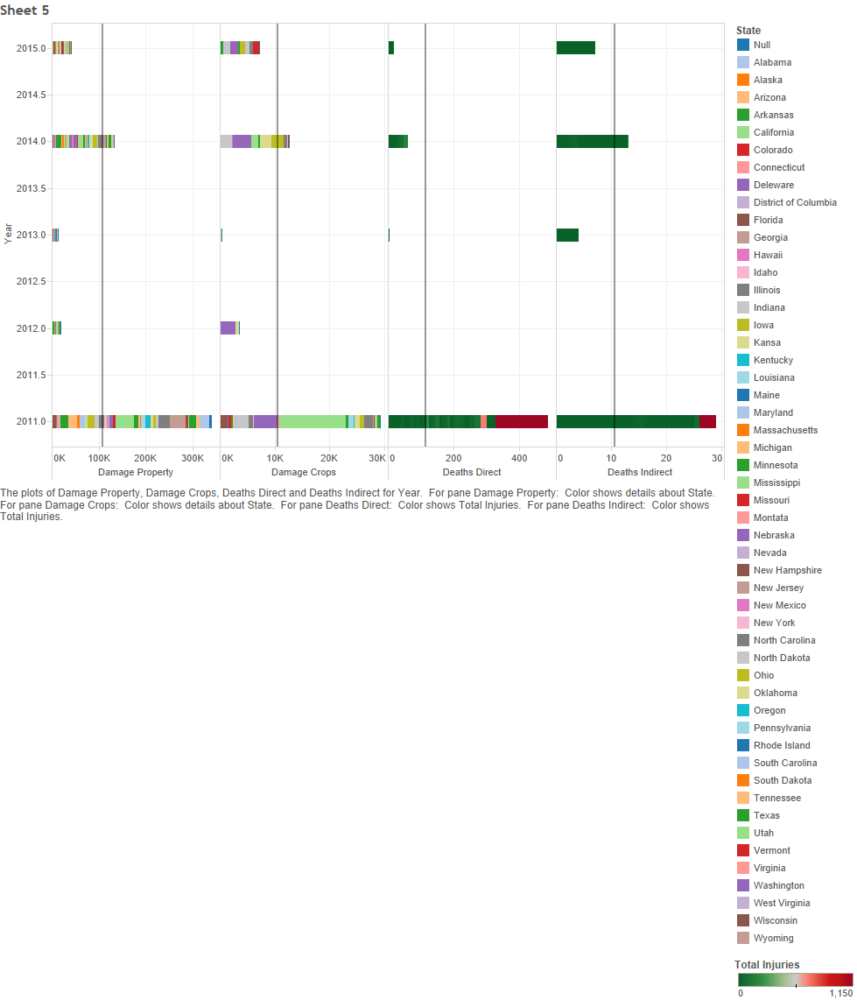

For our final project our team looked at storm data gathered by the United States weather service between 2011 and 2015.

Our first step was to investigate the measures using a boxplot. This one was particularly interesting:

The relationship between the size of the storm and the damage it caused really interested us. 

Next, we applied a KPI which measured the intensity of the event (total damage over time elapsed) and used it to examine the distribution of damage. 

For our Crosstab we examined the relationship between state, year, and our Damage KPI.

Before: The result of plugging in the data

After: The result of filtering and adding parameters

A Scatter Plot was developed to show more facets and interesting features of the data. First, a calculated field was developed, taking the absolute value of the difference between the start and end time, in base 10. This time was plotted versus property damage, where property damage is greater than 0 and where direct deaths is greater than 0. The points are colored in a magnitude gradient.

A combination Bar Graphs was made to show the death and destruction cause by the storms each year. The first graph shows the property damage done, the second shows the crop damage. These two graph are colored by state in order to show how the damage varies from state to state during a given year. The third graph shows the deaths caused directly by the storms and the fourth show the death that were a result of the storm but weren't a direct result. These two graphs were colored by the total injuries from each storm for that year in order to show the relationship between deaths and injuries caused by the storms.
